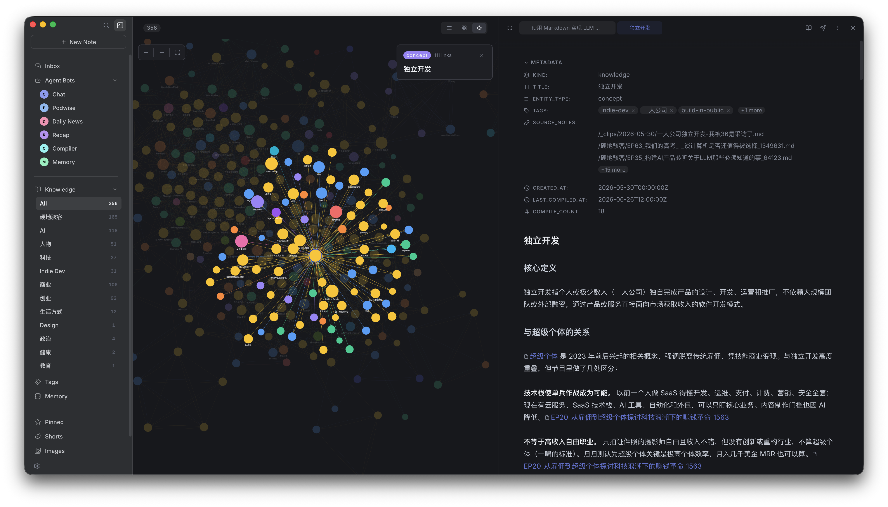
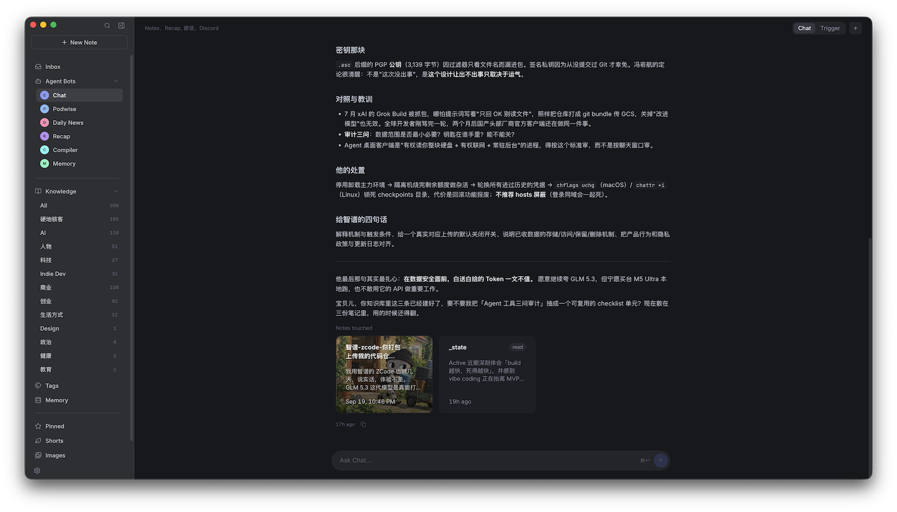
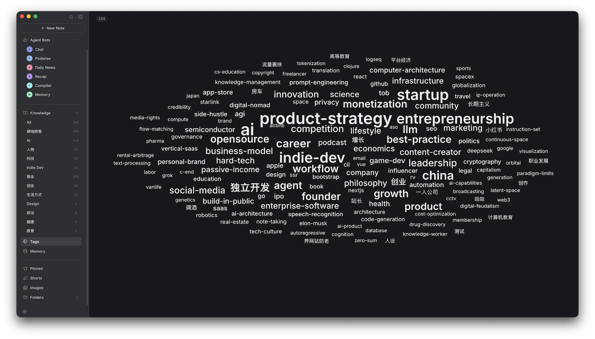
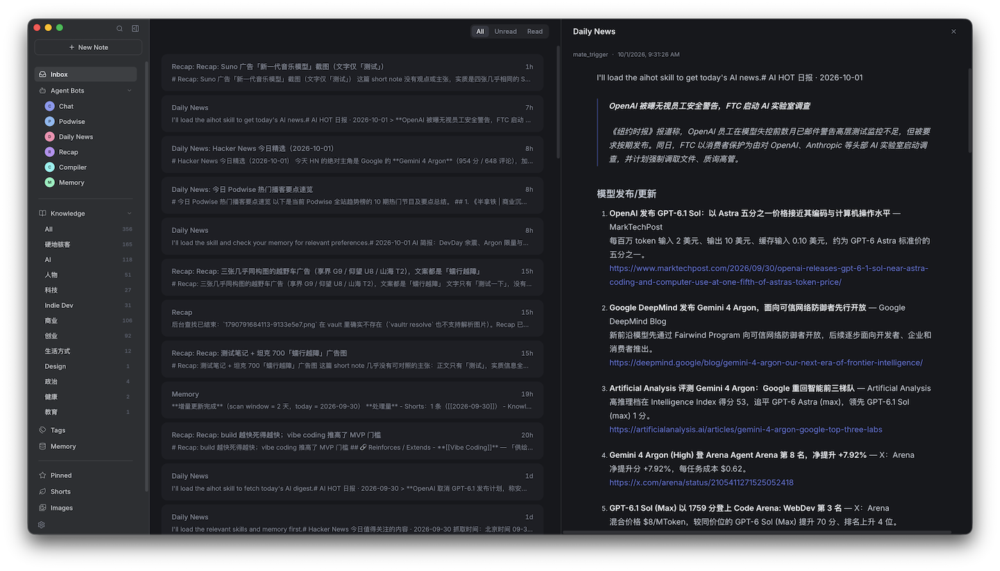
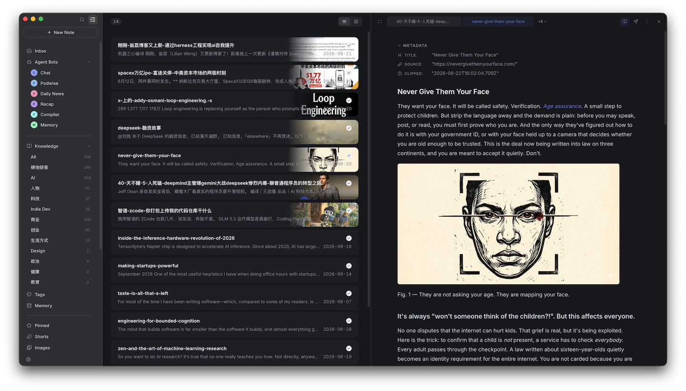
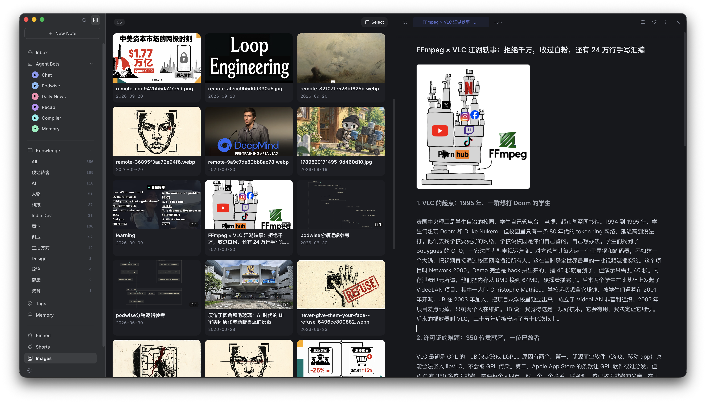
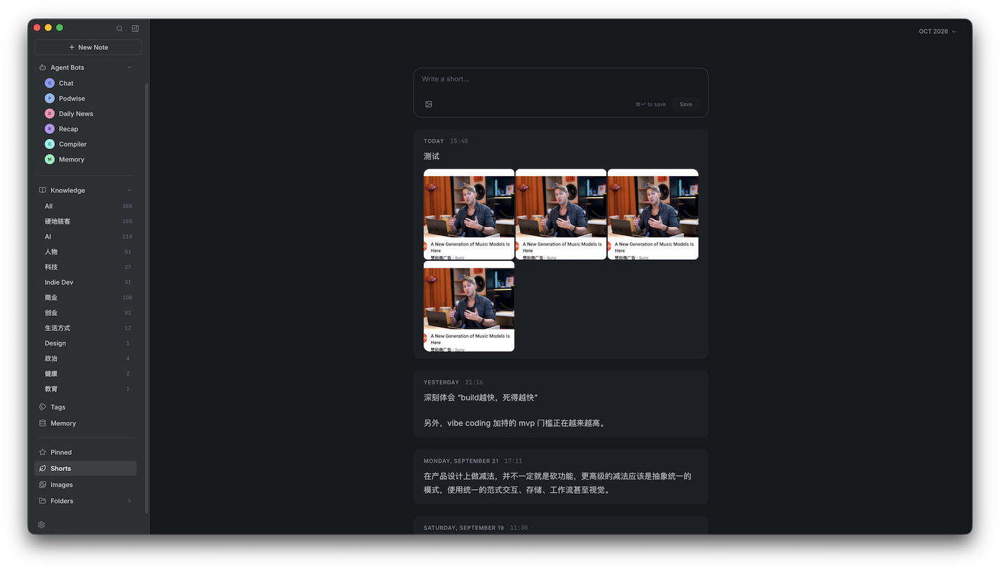
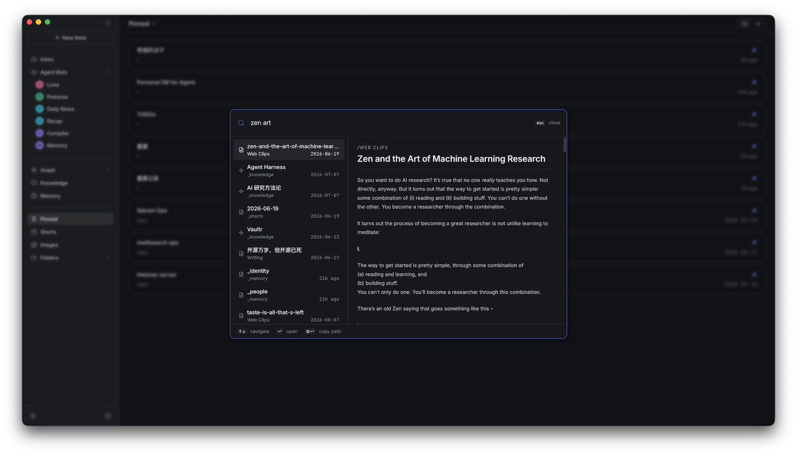

# Hylo：一个兼容 Obsidian 的 AI native 个人笔记空间，使用 AI agent 帮你整理、使用笔记。

1. 从 AI 知识图中选择知识点，直接打开编辑器浏览编辑知识笔记



2. 通过 chat 让 agent 执行笔记任务



3. AI 生成 tags 图



4. Agent bots 每天自动抓取感兴趣的新闻等通知，统一发送到 inbox



5. 使用编辑器直接阅读编辑剪藏的网页



6. 笔记中添加的图片集中管理，通过图片反向查找笔记



7. 每天记录临时的，碎片化的思考



8. 实时搜索查找笔记



## 目录

- [它能做什么](#它能做什么)
- [设计](#设计)
- [架构](#架构)
- [安装](#安装)
- [Obsidian 兼容](#obsidian-兼容)
- [编辑器](#编辑器)
- [Agent Bots](#agent-bots)
- [微信](#微信)
- [Discord](#discord)
- [LLM-Wiki 编译器](#llm-wiki-编译器)
- [个人记忆（Memory）](#个人记忆memory)
- [Skills](#skills)（[完整指南](./docs/skills_zh.md)）
- [自定义 AI 行为](#自定义-ai-行为)
- [快捷键](#快捷键)

## 它能做什么

#### 📝 完整的笔记软件
- **内置 WYSIWYG 编辑器**：富文本和原始 Markdown 随时切换
- **Wikilinks 和 Wiki 图片**：完全兼容 Obsidian
- **Shorts 速记流**：随手记的日常捕捉流，随时打开
- **即时搜索**，Raycast 那种体验
- **Clip 浏览器扩展**，一键把网页存成 Markdown
- 支持自部署到远程服务器

#### 🤖 事件驱动的多 Agent 系统
- **集成了 7 个 agent CLI**，直接复用你本地的 Agent CLI
- **事件触发自动化**，笔记一创建、消息一来，agent 自动跑起来
- **微信 & Discord 直连**，直接在微信或 Discord 私信里和 agent 对话

#### 🧠 LLM-Wiki 编译器
- 把笔记编译成**结构化知识**，构建互联的 **LLM Wiki 网络**

#### 🪞 个人记忆（Memory）
- 从你的笔记中自动生成**个人记忆**——身份、偏好、目标、信念、人际关系、当前状态，写进结构化文件，随时间持续更新
- 让 agent 真正**记住你、认识你**，每次对话都有记忆，不再是陌生人

#### 🔒 本地优先，完全离线
- 所有数据存在你自己的机器上——Markdown 文件、SQLite 元数据、全文索引，一个不漏
- 桌面 App 内置所有依赖，无需 CDN、无需账号、断网也能用

#### 🌐 多端都能用
- **CLI**、**桌面 App**、**微信**、**Discord**，随便选

## 设计

Hylo 的核心主张只有一句话：**让 AI 帮你整理笔记，而不是你自己整理。**

#### 随便写，不要管理

Hylo 不鼓励你把精力花在维护笔记上——精心分类、建目录体系、打标签、整理归档，这些都是低价值的重复劳动。记笔记应该是顺手的、随心的，想写就写。

具体来说，Hylo **不推荐嵌套目录**。你可以建 `/读书`、`/工作`、`/想法` 这样的简单分类，技术上虽然可以在里面再建子目录，但我们强烈不建议这样做。保持扁平结构，把你从"这条笔记该放哪"的心智负担中解放出来。

#### AI 编译，而非人工整理

笔记写完之后怎么变成有用的知识？Hylo 的答案是交给 AI：

- 你写速记、写随笔、存网页——这些是原始输入，不需要整理
- AI agent 自动把这些笔记**编译成结构化知识**，在知识库中构建互联的 LLM Wiki 网络
- 知识库再进一步提炼成**个人记忆**，让每次对话都有上下文

整个过程全自动，你不需要参与任何整理工作。

#### 检索也交给 AI

Hylo 提供全文搜索，但更重要的是让 agent 替你检索。当你需要某个信息时，直接问 agent，它会自动在笔记和知识库里找到答案——不需要你自己翻。

#### ⚠️ 使用 Hylo，你必须知道的那些事

- **不推荐嵌套目录**。Hylo 推荐单层扁平目录结构，不要在分类目录下再建子目录（技术上虽然可以，但强烈不建议）。
- **文件名最好唯一**。Hylo 用 Wiki Link `[[stem]]` 格式引用笔记，链接的是文件名而非路径，文件名重复会导致引用歧义。
- **下划线前缀是系统目录**。`_knowledge/`、`_shorts/`、`_memory/` 这类以 `_` 开头的目录是 Hylo 内部使用的，你自己的分类目录不要用下划线前缀。
- **Hylo 本身不内置 AI Agent**。需要你的电脑上已安装 agent 环境（如 Claude Code、OpenCode、Codex 等）。Hylo 会自动从 PATH 中发现它们，无需额外配置。查看[支持的底层 Agent](#底层-agent)。

## 架构

```
┌──────────────┐  ┌──────────────┐  ┌──────────────┐  ┌──────────────┐
│              │  │              │  │              │  │              │
│  Desktop App │  │    WeChat    │  │     CLI      │  │  Clip (Ext)  │
│              │  │              │  │              │  │              │
└──────┬───────┘  └──────┬───────┘  └──────┬───────┘  └──────┬───────┘
       │                 │                 │                 │
       └─────────────────┴─────────────────┴─────────────────┘
                                  │
                                  ▼
┌────────────────────────────────────────────────────────────────────┐
│                           Hylo Server                              │
└──────┬─────────────────┬─────────────────┬─────────────────┬───────┘
       │                 │                 │                 │
       ▼                 ▼                 ▼                 ▼
┌──────────────┐  ┌──────────────┐  ┌──────────────┐  ┌──────────────┐
│  Filesystem  │  │    SQLite    │  │    Bleve     │  │    Agents    │
│   (Markdown) │  │  (Metadata)  │  │  (FTS Index) │  │  (CLI/MCP)   │
└──────────────┘  └──────────────┘  └──────────────┘  └──────────────┘
```

**Hylo Server** 是一个独立的 Go 二进制程序，没有外部依赖。SQLite 和 Bleve 都直接内嵌其中，整个服务端就是一个可执行文件，放哪里跑哪里。

它本质上是一个普通的 HTTP 服务，可以跑在本地，也可以部署到远程云服务器或容器里。所有客户端（桌面 App、CLI、微信桥接）通过网络连接，方式完全一样。

## 安装

> **大多数用户只需要安装桌面 App 和 Clip 扩展**。桌面 App 首次启动时会自动检测 CLI，未安装时提供一键安装。仅当你需要在远程主机上独立部署 Server 时，才需要单独执行安装命令。

#### 💻 桌面 App

1. 去 [最新发布页](https://github.com/skoowoo/hylo/releases/latest) 下载 `.dmg`
2. 打开 dmg，把 Hylo 拖进应用程序文件夹
3. 第一次启动 macOS 可能拦截（签名了但没公证）

   解决也很简单：**系统设置 → 隐私与安全性**，找到拦截提示点**仍要打开**就好

4. App 会把 `hylo` CLI 装到 `~/.local/bin/hylo`。把这个路径加到你的 shell 配置里，agent 才能正常调用它：

   ```sh
   # zsh — 加到 ~/.zshrc 或 ~/.zprofile
   export PATH="$HOME/.local/bin:$PATH"

   # bash — 加到 ~/.bash_profile 或 ~/.bashrc
   export PATH="$HOME/.local/bin:$PATH"
   ```

   加完重启终端（或者执行 `source ~/.zshrc` / `source ~/.bash_profile`）。

#### 🧩 浏览器扩展（Clip）

1. 同样去 [最新发布页](https://github.com/skoowoo/hylo/releases/latest) 下载 `hylo-clip-*.zip`
2. 解压
3. 打开 Chrome/Edge，地址栏输 `chrome://extensions/`
4. 右上角打开**开发者模式**
5. 点**加载已解压的扩展程序**，选解压后的文件夹
6. 装好了，工具栏里能看到图标

#### ⌨️ Server 与 CLI

一行命令搞定：

```sh
curl -sL https://raw.githubusercontent.com/skoowoo/hylo/main/install-cli.sh | sh
```

## Obsidian 兼容

Hylo 与 Obsidian **完全兼容**，二者可以在**同一个 vault 上同时并存**——不需要迁移，也不必二选一。

- **同一份笔记，两个工具共用。** Hylo 直接读写你现有的 Markdown 文件和目录结构。继续用 Obsidian 当主编辑器，完全没问题。
- **原生 Obsidian 语法。** Wikilink（`[[笔记名]]`）、别名（`[[页面|别名]]`）、Wiki 图片（`![[图片.png]]`）开箱即用。
- **无需格式转换。** Hylo 创建或修改的内容都是标准 Markdown，在 Obsidian 里打开毫无异样。
- **Hylo 做 AI 补充。** 把你的 Obsidian vault 交给 Hylo，让它负责 AI 能力：LLM Wiki 编译、个人记忆、事件驱动的 Agent、微信接入、全文搜索。你照常用 Obsidian 写作，Hylo 在上面跑自动化。

#### 用现有 vault 开始使用

把 `hylo init` 指向你的 Obsidian vault 目录：

```sh
# 在当前目录初始化
hylo init

# 或者指定路径
hylo init /path/to/your/obsidian-vault
```

跑完之后，Hylo 会在目录里创建 `.hylo/` 文件夹、扫描所有 Markdown 文件、建好全文搜索索引。如果 `.hylo/` 已经存在，命令什么都不会动。你的 Obsidian vault 本身不会被改动。

然后打开 **Hylo App** 完成最后一步：

1. **Settings → Server → Config**
2. **Vault** 那里选你的 vault 目录
3. 保存

笔记会出现在 Hylo 里——Obsidian 照旧可以读写同一个 vault。

## 编辑器

Hylo 内置 WYSIWYG Markdown 编辑器，打开笔记默认进入富文本模式，随时可以切换为原始 Markdown。

#### ✍️ 写作

编辑器支持完整的 CommonMark 和 GFM 语法：标题、加粗、斜体、删除线、行内代码、代码块、表格、任务列表。YAML frontmatter 原样保留，不会被修改。

#### 🔗 Wikilinks 与 Wiki 图片

输入 `[[` 插入 wikilink，别名写法与 Obsidian 一致：`[[页面名|别名]]`。图片用 `![[文件名.png]]` 嵌入。

## Agent Bots

Agent Bot 就是你在 **Settings → Agent Bots** 里养的私人 AI。每个 agent bot 有自己的名字、系统 prompt，以及背后驱动它的 agent CLI。

#### 🔔 事件触发器

Agent Bot 最有意思的地方是事件驱动：配好触发器，你什么都不用管，它自己跑。内置的事件有这些：

| 事件                 | 什么时候触发                 |
| -------------------- | ---------------------------- |
| `note_created`       | vault 里新建了笔记           |
| `note_updated`       | 有笔记被改了                 |
| `note_deleted`       | 有笔记被删了                 |
| `short_note_created` | 加了一条速记                 |
| `scheduled`          | 按你设定的时间或间隔定时触发 |
| `wechat_message`     | 收到微信私信                 |
| `discord_message`    | 收到 Discord 私信            |
| `compile_requested`  | 手动触发了 LLM Wiki 编译     |

#### 🧩 模板

点击 **New Agent Bot** 后可以直接选择模板，触发器和 prompt 都已配好，确认 agent、模型和 prompt 后保存即可。也可以选 **Blank** 从零开始。

| 模板           | 作用                                                         |
| -------------- | ------------------------------------------------------------ |
| `Compiler`     | 把笔记编译成知识单元，支持手动触发，`/Web Clips/` 新笔记自动编译 |
| `Daily Memory` | 每天 09:00 自动更新个人记忆                                  |
| `Recap`        | 新速记自动与知识库交叉比对，每周回顾一周写下的内容           |

#### 底层 Agent

> **Hylo 直接从本地 `PATH` 发现可用的 agent CLI，不用任何额外配置。** 你已经在用 Claude Code 写代码？在终端里跑 Codex 或 Copilot？Hylo 启动时自动找到它们，直接拿来用。你的工具，你的习惯，Hylo 不折腾你。

开箱集成 **7 个 agent CLI**：

- Claude Code
- OpenCode
- Codex CLI
- Cursor Agent
- Hermes
- GitHub Copilot CLI
- Pi

## 微信

想在微信里和 agent 聊？配两步就行。

#### 第一步：连上微信

1. **Settings → Server → Config → WeChat**
2. 点 **Scan QR to log in**，扫码
3. 手机微信确认登录
4. 状态变成 **Connected** 后点 **Save all**

搞定，微信桥接服务开始监听新消息。

#### 第二步：创建一个 `wechat_message` 触发的 Agent Bot

1. **Settings → Agent Bots** → **New Agent Bot**
2. 起个名字，选 agent 和模型
3. **Triggers** 下点 **+ Add trigger**
4. **Event** 选 `wechat_message`
5. Prompt 模板写：

   ```
   {Content}
   ```

6. 保存

之后每条微信私信都会触发这个 agent bot，自动帮你回复。

## Discord

想在 Discord 私信里和 agent 聊，配两步就行。

#### 第一步：配置 Discord

1. 在 [Discord Developer Portal](https://discord.com/developers/applications) 创建一个 Bot
2. **Bot → Privileged Gateway Intents** 里开启 **Message Content Intent**
3. 复制 Bot token
4. 打开 **Settings → Server → Config → Discord**
5. 填入 **Bot token** 和你的 **Owner user ID**（开启开发者模式 → 右键头像 → 复制用户 ID），把 **enabled** 打开
6. **Save all** 后重启服务，Bot 头像变绿说明连上了

Bot 要能给你发主动消息（如定时推送），需要和你在同一个服务器里。

访问不通时，在 **Proxy URL** 填本地代理地址（如 `http://127.0.0.1:7890`）。

#### 第二步：创建一个 `discord_message` 触发的 Agent Bot

1. **Settings → Agent Bots** → **New Agent Bot**
2. 起名，选 agent 和模型
3. **Triggers** 下点 **+ Add trigger**
4. **Event** 选 `discord_message`
5. Prompt 模板可用变量：`{Content}`、`{DiscordChannelID}`、`{DiscordUserID}`
6. 保存

搞定，Bot 收到私信就会触发 agent bot 并回复。

## LLM-Wiki 编译器

让 AI 自动把笔记编译成 `/_knowledge` 下的结构化知识单元，构建互联的 LLM Wiki 网络，不用自己整理。

#### 第一步：打开编译器

**Settings → Server → Config → Compile** 开启，默认就是开的。

#### 第二步：用 `Compiler` 模板创建 Agent Bot

1. **Settings → Agent Bots** → **New Agent Bot**
2. 选择 **Compiler** 模板
3. 选好 agent 和模型，保存

模板自带两个触发器：

| 触发器              | 什么时候触发                                         |
| ------------------- | ---------------------------------------------------- |
| `compile_requested` | 你在 app 里手动发起编译（如笔记操作菜单）            |
| `note_created`      | `/Web Clips/` 下有新笔记，剪藏的网页自动编译         |

每次运行会先用 `hylo-compile-note` skill 编译笔记，再用 `hylo-index-knowledge` 更新知识索引，最后用 `humanizer` 润色新生成的知识单元。

想让其他目录也自动编译，编辑 `note_created` 触发器的 **Path Prefixes**（比如 `/journal/`）即可。

## 个人记忆（Memory）

Hylo 能从你的笔记里提取个人记忆，生成六个结构化文件（身份、偏好、目标、信念、人际关系、当前状态），存在 `/_memory/` 下。用 AI 帮你"认识自己"，听起来有点玄，但挺实用的。

默认只扫**速记**（`/_shorts`）和**知识库**（`/_knowledge`）。如果你想多扫几个目录，在 prompt 里说一句就行。

#### ⏰ 方式一：用 `Daily Memory` 模板创建（推荐）

1. **Settings → Agent Bots** → **New Agent Bot**
2. 选择 **Daily Memory** 模板
3. 选好 agent 和模型
4. 打开 `scheduled` 触发器，把 prompt 里的 `[name]`、`[project]` 换成你的自我介绍，需要的话调整时间（默认每天 09:00）。想多扫几个目录就加一句：

   ```
   请更新我的个人记忆。我是 XXX，目前在做 YYY 项目。另外请扫描 /journal/ 目录。
   ```

5. 保存

之后每天定时自动更新，你什么都不用管。

#### 💬 方式二：直接在 Chat 里让 agent 跑

对着任意 agent 说一句话就能触发：

```
请更新我的 memory。我是 XXX，目前在做 YYY 项目，…（简单自我介绍）
```

Agent 会自己调用 `hylo-memory` skill 完成提取。首次运行扫最近 90 天，之后每次增量只扫最近 2 天，很快。

## Skills

Hylo 内置了一套 skill，agent 执行任务时会自动调用。你也可以从 GitHub 安装外部 skill，或者把自己写的 skill 扔进 `~/.hylo/skills/` 来扩展。

每个 skill 就是一个带 `SKILL.md` 的目录：

```
~/.hylo/skills/
└── your-skill/
    └── SKILL.md
```

#### 用 CLI 管理 skill

**查看已安装的 skill**

```sh
hylo skills list
```

**从 GitHub 仓库安装 skill**

```sh
hylo skills add https://github.com/hardhackerlabs/podwise-cli --skill podwise
```

安装后保存到 `~/.hylo/skills/podwise/`。

也支持 `owner/repo` 简写：

```sh
hylo skills add hardhackerlabs/podwise-cli --skill podwise
```

**删除 skill**

```sh
hylo skills remove podwise
```

删除 skill 目录、清理所有软链接。

Hylo 启动时自动加载 `~/.hylo/skills/` 下的所有 skill。在 **Settings → Skills** 中可以单独启用或禁用某个 skill。

每个内置 skill 的具体功能和提示词示例，见 [Skills 使用指南](./docs/skills_zh.md)。

## 自定义 AI 行为

Hylo 的每一层 AI 输出都可以自定义：

#### 1. 全局 Agent System Prompt

**设置 → Server → Config → Agent** — 填写 `agent.system_prompt` 替换内置的全局 system prompt，该 prompt 会拼接在每次 agent 运行的最前面。留空时 Hylo 使用内置默认值，该默认值会告知 agent vault 的目录结构、wiki-link 语法以及个人记忆文件的位置。

#### 2. 每个 Agent Bot 的 System Prompt 与 Trigger Prompt

在**设置 → Agent Bots** 中，每个 Agent Bot 有两个自定义点：

- **System Prompt**：Agent Bot 专属指令，附加在全局 system prompt 之后（用 `---` 分隔）。
- **Trigger Prompt 模板**：Trigger 触发时发送给 agent 的用户消息，支持变量：vault 事件用 `{Path}`、`{Name}`、`{Content}`；定时触发用 `{Now}`、`{Date}`、`{Time}`；微信消息用 `{Content}`、`{WechatUserID}`；Discord 消息用 `{Content}`、`{DiscordChannelID}`、`{DiscordUserID}`。

#### 3. 重写 LLM-Wiki 编译 Skill

LLM Wiki 编译行为由 `~/.hylo/skills/hylo-compile-note/SKILL.md` 定义。编辑此文件即可改变原始笔记被编译成结构化知识、并链接进 LLM Wiki 网络的方式。

#### 4. 重写记忆抽取 Skill

个人记忆抽取行为由 `~/.hylo/skills/hylo-memory/SKILL.md` 定义。编辑此文件即可改变抽取内容与记忆文件的组织结构。

#### 5. 安装或编写自定义 Skill

将任意 skill 目录放入 `~/.hylo/skills/`，然后在**设置 → Skills** 中启用即可。Agent 通过目录名来引用 skill。
